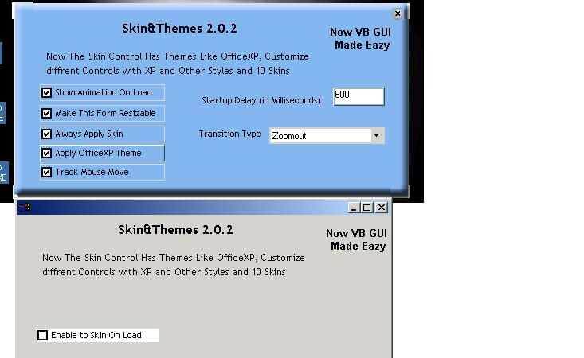



## Attractive and easiest Skin Addin  and NOW OfficeXP theme to VB Forms \(Update \- 29th July\)

### Description

A complete Skin Layer to any visual Basic Form NOW 10 SKINS WITH XP THEMES , SO YOU CAN CREATE A OFFICE XP LIKE WINDOW WITHOUT WRITING THE CODE FOR IT.

It supports Different ANIMATIONS, TIMINGS,RESIZE and ..... .

It is the easiest layer to add Skins and transitions to any of your VB form,

. whether it is new or Old VB Forms. Now you can Make your Applications Most attractive with a single Statement. the ZIP is (WinZIP/99.0 KB).

Memmory Leak Fixed and Transition types are added on 20th July.

OFFICE XPTHEME, 5 NEW SKINS and SUCLASSING are added on 29th July.

I've also mentioned the All credits after mutual discussion for the Same.
 
### More Info
 

             |
---                |---
**Submitted On**   |2002-07-29 20:06:02
**By**             |[joyprakash saikia](https://github.com/Planet-Source-Code/PSCIndex/blob/master/ByAuthor/joyprakash-saikia.md)
**Level**          |Intermediate
**User Rating**    |4.9 (262 globes from 53 users)
**Compatibility**  |VB 5\.0, VB 6\.0
**Category**       |[Graphics](https://github.com/Planet-Source-Code/PSCIndex/blob/master/ByCategory/graphics__1-46.md)
**World**          |[Visual Basic](https://github.com/Planet-Source-Code/PSCIndex/blob/master/ByWorld/visual-basic.md)
**Archive File**   |[Attractive11199972920\.zip](https://github.com/Planet-Source-Code/joyprakash-saikia-attractive-and-easiest-skin-addin-and-now-officexp-theme-to-vb-forms-upd__1-37074/archive/master.zip)

